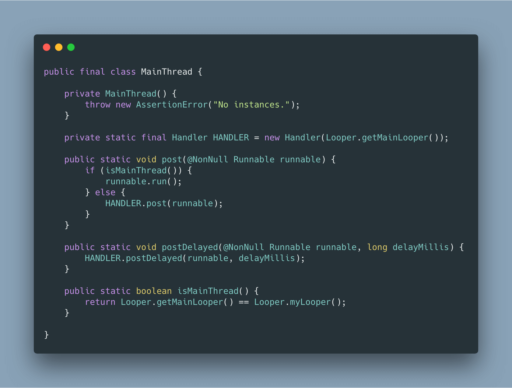
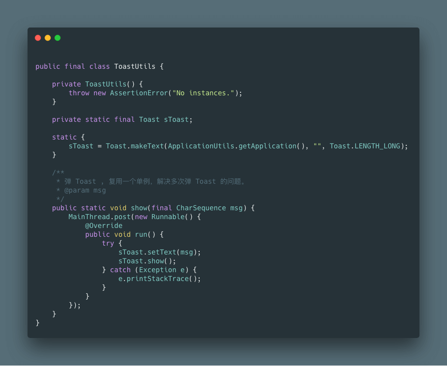
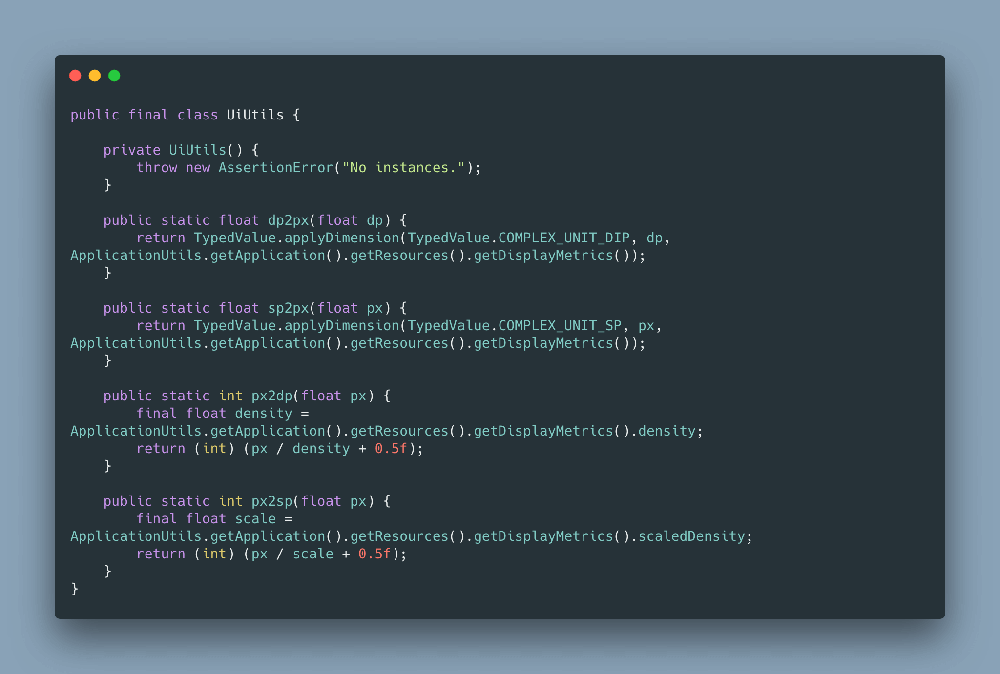

# Pandora


Pandora 是一个 Android 工具类的集合，包含两个版本：

1. basic 版本，只会包含非常非常基础的 Utils ,比如全局提供 Application 能力的类；
2. full 版本，会包含各种 Utils ，涉及到 Android 开发的方方面面；

当只需要非常基础的能力时可以依赖 basic 版本： `1.0.3-basic` (带有 -basic 后缀), 代码在 `basic` 分支，推荐！；

当需要依赖大量 Pandora 包含的 Utils 时，才需要依赖 full 版本：`0.0.6` ，代码在 `master` 分支，不推荐！；


**推荐只依赖 basic 版本，避免引入过多不需要的类，增加包体积。**


### Getting Started


```groovy
implementation 'me.yifeiyuan.pandora:pandora:version'
```


### Basic 版本能力


Basic 只包含一些非常常见且实用，绝大多数 APP 都需要的工具类，在保证避免编写大量样板代码的基础之上，减少引入不必要类的可能，防止包体积增大。


努力做到真正需要才加入到 basic 版本。

> 注意: 方法可能有变，请以实际代码为准。

#### ApplicationUtils


一个可以设置、获取全局 Application 的工具类，Context 在 Android 中非常常用，但是其实很多时候我们不需要传递 Activity 类型的 Context ， **使用 `ApplicationUtils` 可以缓解我们到处传递 Context 的困境**。（默认会从 ActivityThread 获取 Application）


#### MainThread


一个关于主线程的工具类，**可以方便地将 Runnable post 到主线程执行**。





#### ToastUtils


一个全局单例 Toast ，**解决多次实例化 Toast 导致不停弹 Toast 的问题**。





#### LifecycleHandler


在使用 Handler 的时候我们总是担心 Handler 会导致内存泄露，于是我们每次都会在 onDestroy 方法里移除 Handler 的消息，编写样板代码，LifecycleHandler 的出现就是为了解决这个困境，**使用它，你不再需要关注 onDestroy 啦！**


#### UiUtils


Android 开发不可避免的要跟像素 dp 等打交道，UiUtils 包含一些数据单位转换的操作。





#### Predictions


一个用来做”断言”的功能的工具类，用来验证判断参数是否合法。

虽然我们有 NonNull 等注解 ，但是依然避免不了外部传递非法参数，这个时候我们避免不了写样板代码，检测参数是否非法，如果是则抛出异常，**Predictions 可以让你少写一些检查抛、异常的样板代码**。


（最后一个方法多了个! 在代码中已删除，请放心使用！）